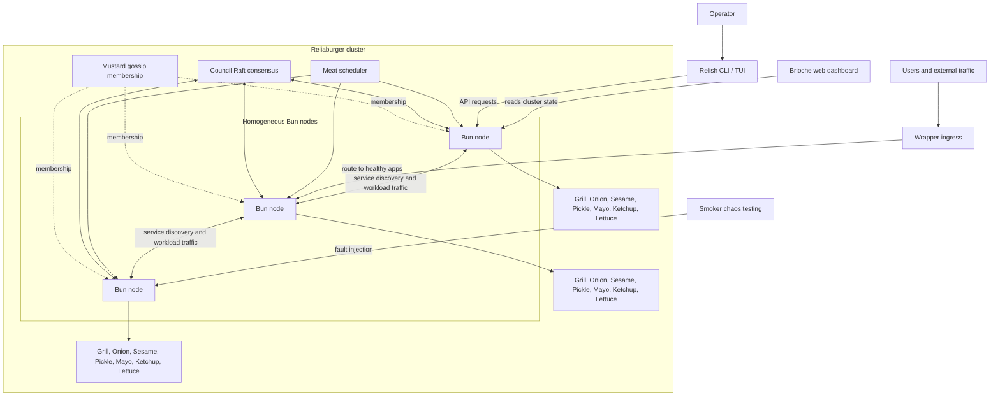

<p align="center">
  
</p>

# Reliaburger

One binary. A whole container platform.

Reliaburger is a batteries-included container orchestrator written in Rust,
for teams running 2-5,000 nodes who want containers in production without
the PhD. The things you normally assemble from a dozen projects — scheduling,
gossip clustering, Raft consensus, service discovery, ingress, mTLS PKI, an
OCI image registry, metrics, logs, dashboards, GitOps, chaos testing, even
rolling self-upgrade of the orchestrator itself — ship compiled into one
`bun` agent and one `relish` CLI.

No sidecars. No add-on shopping list. No YAML archaeology. You get:

- **A built-in guide.** `relish manual` provides searchable documentation
  and runnable examples without a repo checkout or internet connection.
- **A cluster that heals itself.** SWIM gossip membership, a self-healing
  Raft council, automatic rescheduling, council disaster recovery, and
  rolling binary upgrades where workloads survive the swap.
- **Security that's on by default.** Generated clusters require mTLS;
  joins are single-use-token, CSR-based; images can be signature-gated;
  secrets are encrypted at rest, with
  [public encryption keys available over the API](docs/README.md#encrypting-secrets-without-cluster-files).
  Cluster-signed ingress leaves renew on demand
  before expiry, and operator certificate files reload without a restart.
  Node leaves renew automatically through the current leader, and every node
  transport observes replacements. TLS connections have bounded lifetimes.
  `relish test --filter workload-identity` checks a container's SPIFFE certificate
  against the configured cluster CA, alongside JWKS and token-scope checks.
- **Batteries you'd otherwise deploy separately.** Built-in registry with
  P2P image distribution, time-series metrics with SQL, indexed logs,
  ingress with TLS and draining, web + terminal dashboards, and a fault
  injector for breaking things on purpose.

The full architectural vision lives in the [whitepaper](docs/whitepaper.md).
Install and usage details are in the [documentation](docs/README.md), and
implementation status in [progress.md](docs/progress.md).

## 0.1.0 scope and limits

0.1.0 is the first release, so we've kept its promises narrow and explicit:

- **Container clusters run on rootful Linux Runc with eBPF.** Set
  `[ebpf] enabled = true` and make bpffs available at `/sys/fs/bpf`. Bun owns
  every Runc container durably: it records the launch before starting it,
  adopts it again after a restart, and releases the container's address only
  after cleanup is confirmed.
- **Rootless Runc is standalone only.** Bun refuses to start with `--cluster`
  when Runc runs without root. A rootless node gets host-port forwarding, but no
  eBPF policy, workload DNS or resource limits.
- **Declarative image workloads need root mode.** App specs ask for a writable
  root filesystem, which rootless Runc can't provide safely yet. See the
  [runc notes](docs/README.md#runc-linux).
- **macOS runs containers through a managed Linux VM.** `relish setup
  --quickstart` provisions it. Direct Apple Container is disabled for 0.1.0;
  native macOS Bun runs process workloads.
- **Native processes are foreground-only.** The main process stays under Bun's
  supervision and its children must stay in the supervised process group.
  Daemonising or detached workloads belong in Linux containers. See the
  [runtime contract](docs/README.md#processgrill-built-in-fallback).
- **Clusters start fresh.** There's no upgrade path from development builds:
  Bun refuses their state, so create a new cluster. Rolling upgrades between
  releases need matching protocol and state formats; see the
  [compatibility policy](docs/releasing.md#cluster-compatibility).
- **Jobs and cron don't replay uncertain work.** Cron skips firings it missed
  during a crash, with no catch-up. A job whose outcome is unknown after a crash
  stays unknown until you check its effects and run
  `relish apply jobs.toml --rerun-jobs`.

## Quick start

Source builds require Rust 1.97 or later; releases use Rust 1.98.0 and the
committed lockfile.

```sh
cargo build --locked --bins

# Run the node agent — no container runtime needed for the first taste
target/debug/bun --runtime process

# In another terminal: deploy, inspect, explore
target/debug/relish apply examples/phase-1/proc-first-run.toml
target/debug/relish status
target/debug/relish            # interactive terminal dashboard
open http://localhost:9117/    # web dashboard
```

Process mode runs plain OS processes, so it works on macOS and Linux without a
container runtime. Keep workloads in the foreground: use the application's
no-daemon option, and have shell wrappers `exec` the server or wait for their
children.

With runc installed on Linux, the same flow runs real OCI images, and
`relish init <dir>` generates the PKI and mTLS config for a secure multi-node
cluster. The [documentation](docs/README.md) has the full secure-cluster
walkthrough. On macOS, use the [managed Linux VM quickstart](docs/quickstart.md)
for containers.

A blocked rollout can be cancelled with `relish cancel-deploy <operation-id>`.
The command waits for in-flight work to finish before you submit the fix;
cluster users should also update the desired configuration. See the
[deployment guide](docs/README.md).

## The manual is in the binary

Reliaburger documents itself. `relish manual` opens the reference as a
searchable terminal reader — chapters, runnable examples, fuzzy search —
with no repo checkout and no internet:

```sh
relish manual              # read it in the terminal (/ to search)
relish manual --web        # the same manual as one page in your browser
relish manual examples     # drop the runnable example configs right here
```

<!-- asciinema: `relish manual` demo cast goes here -->

The source ships too. `relish source ebpf` opens a fuzzy search over the
exact `src/` tree the binary was compiled from. The platform carries its own
reference, examples and implementation wherever the binary goes.

## The book

This repository is also a book. *Building Reliaburger* walks through how
every subsystem was designed and built — teaching Rust and distributed
systems along the way, aimed at programmers coming from C, Python or Go:

0. [Preface](docs/book/00-preface.md)
1. [Hello, Container](docs/book/01-hello-container.md)
2. [Finding Friends](docs/book/02-finding-friends.md)
3. [Talking to Each Other](docs/book/03-talking-to-each-other.md)
4. [Trust No One](docs/book/04-trust-no-one.md)
5. [Where the Images Live](docs/book/05-where-the-images-live.md)
6. [Watching Everything](docs/book/06-watching-everything.md)
7. [Ship It](docs/book/07-ship-it.md)
8. [Breaking Things on Purpose](docs/book/08-breaking-things-on-purpose.md)
9. [The Full Package](docs/book/09-the-full-package.md)
10. [Locking It Down](docs/book/10-locking-it-down.md)
11. [Eyes Everywhere](docs/book/11-eyes-everywhere.md)
12. [Squeezing Every Drop](docs/book/12-squeezing-every-drop.md) *(in progress)*
13. [A Room with a View](docs/book/13-a-room-with-a-view.md)
14. [Changing the Tyres at Full Speed](docs/book/14-changing-the-tyres.md)
15. [Ready for Production](docs/book/15-ready-for-production.md) *(in progress)*
- [Appendix: Rust for C, Python, and Go Programmers](docs/book/16-appendix-rust.md)

## What's inside

Thirteen burger-named subsystems in one binary — Grill (runtimes), Mustard
(gossip), Council (Raft), Meat (scheduler), Onion (discovery/DNS/eBPF),
Wrapper (ingress), Sesame (security), Pickle (registry), Mayo (metrics),
Ketchup (logs), Lettuce (GitOps), Smoker (chaos), Brioche (dashboard). The component tour and
repo layout live in the manual (`relish manual`, "Under the hood") and the
[design docs](docs/design/).



## Try it

The managed quickstart records localhost ingress and authenticated registry
forwards. See the [port options](docs/quickstart.md#resume-stop-and-remove).

Use the source-based quick start above while we prepare the first release.
From a checkout, install cargo-nextest 0.9.145 or newer (see
[build prerequisites](docs/README.md#building)), then run the portable tests and
check the examples:

```sh
make test                    # run the portable nextest suite
make audit                   # check dependency advisories
cargo nextest run --test examples  # dry-run every example config
```

With a running, configured cluster and `relish` on your PATH:

```sh
relish status
relish wtf                   # diagnose the live cluster
relish test --profile development
```

The managed laptop flow is now available in the source and undergoing VM
qualification. Once the signed release and website are published, the install
path will be:

```sh
curl -fsSL https://reliaburger.com/install.sh | sh
relish nodes
relish status
relish logs hello
relish dashboard             # Ctrl-C stops the browser connection
# Open http://localhost:18080/
relish local stop
relish local start
relish local destroy --yes   # permanently remove the cluster's VMs and data
```

The installer links `relish` into `~/.local/bin` when that's on your `PATH`;
otherwise it prints the line to add and offers to add it for you.

See the [laptop quickstart](docs/quickstart.md) for prerequisites, single-node
setup, retries and development qualification. The public release is still pending.

See the [diagnostics guide](docs/manual/07_diagnostics.md) for test prerequisites,
profiles and interpreting results. Capacity benchmarks require live scheduler
admission and observed running workloads; missing evidence fails the measurement.

## Getting to 0.1.0

The core platform is implemented. We're preparing a release that takes a
laptop to three healthy Linux nodes and a working sample app, with no Rust
build or repo checkout. **Under five minutes is the target; the public
installer and that timing guarantee aren't available yet.**

What's left is acceptance, not features: a live three-node run of the full test
catalogue, a sustained failure-and-recovery soak, a signed release candidate
installed from its exact published bytes, and repeated cold installs on clean
laptops. The [remaining work](docs/plans/2026-09-22-v0.1.0-remaining-work.md)
lists those gates, and the [0.1.0 release plan](docs/plans/2026-09-16-v0.1.0-release-plan.md)
defines the supported scope. Implementation status lives in
[progress.md](docs/progress.md).

The [candidate and promotion workflow](docs/releasing.md#metadata-and-publication)
builds a release once, signs it, and publishes only the bytes that passed
qualification.

## Contributing

See the [contributing guide](./CONTRIBUTING.md) for more on that.

## Licence

[Apache 2.0](LICENSE)
