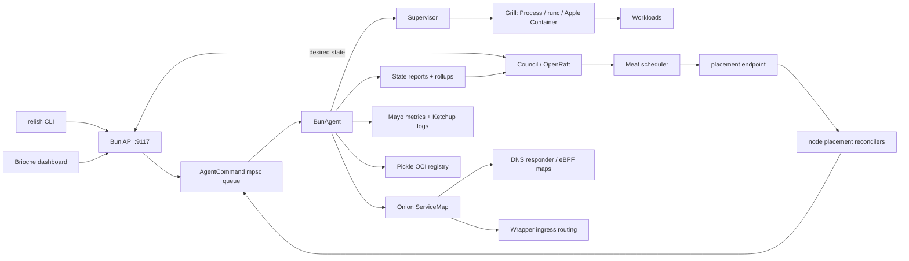

# Reliaburger codebase walkthrough and review

_Review date: 9 July 2026. Reviewed against the current checkout (commit
`49276589`, with unrelated working-tree documentation changes left untouched)._

Reliaburger is one Rust library crate with three binaries:

- `bun` is the long-running node agent. It owns local workload lifecycle,
  local state, background tasks, and the HTTP API.
- `relish` is the operator CLI. It parses commands and either calls Bun's API
  or performs local, configuration-only work such as formatting, compiling,
  and Kubernetes import/export.
- `testapp` is a configurable HTTP process used by integration tests and
  examples.

The repository is substantially larger than the headline estimate: `src/`
contains about 82,900 Rust lines, and `tests/` a further 8,700. The code is
organised by product subsystem rather than by technical layer. That makes the
names memorable, although it also means the true control flow crosses a lot
of module boundaries.

`cargo fmt --check` passed during this review. A full `cargo test` was not
allowed to finish because another Cargo process held the default build lock;
the review therefore treats passing historical tests as useful evidence, not
as proof that this checkout is completely verified.

## The system in one picture

There are two kinds of state in the running system. Bun owns **observed local
state**: processes, ports, health, logs, service-map entries, and node-local
metrics. Council owns **cluster desired state**: app specifications,
placements, security state, image catalogue metadata, and deployment history.



The single `AgentCommand` queue is a deliberate simplification. API handlers
do not mutate `BunAgent` directly: they send a command, often with a one-shot
response channel or an SSE event stream. This keeps local mutable state in
one task and avoids an `Arc<Mutex<BunAgent>>` spread through the process.
It is the right default, but it also means a long command handler delays
health checks, restart work, and every later command. That shows up again in
the review findings.

## Boot and node ownership

`src/bin/bun.rs` is the composition root. Its startup order matters:

1. Parse command-line flags and load `NodeConfig` (or defaults).
2. Resolve the running version and run self-upgrade crash recovery before
   starting other subsystems.
3. Select a Grill runtime and make the agent command channel and cancellation
   token.
4. Create Mayo before cluster startup because leader-side rollups consume it.
5. In `--cluster` mode, start gossip, Council/Raft, reporting, rollups and the
   placement machinery; then construct `BunAgent::with_cluster`. Otherwise,
   construct a local `BunAgent`.
6. Configure the agent with capacity, eBPF handles where available, token and
   secret material, log forwarding, image policy, upgrade manager and persisted
   instance records.
7. Start optional DNS and ingress listeners, then the agent task.
8. Start metrics collection, log flush/export, disk-pressure, alert,
   replication/GC, GitOps, API and OCI registry tasks.

Most of the live wiring can be read top-to-bottom in
[`src/bin/bun.rs`](../src/bin/bun.rs). The long file is informative but it is
also doing too many jobs: construction, policy, storage fallbacks, task
supervision, API composition and signal handling. Splitting this into a
`NodeRuntime::start(config)` builder and one task per subsystem would make
both test setup and failure ownership much easier to reason about.

### Configuration

`src/config/` models application TOML and node TOML separately.

- `Config` contains `app`, `job`, namespace and shared workload concerns.
  `AppSpec` includes image/command, replicas, resources, health, volumes,
  ingress, placement, deployment, egress and autoscaling.
- `NodeConfig` contains node identity, cluster ports, storage, networking,
  image registry, metrics/logs, security, DNS, eBPF and upgrade sections.
- `validate.rs` is intentionally a second pass after deserialisation. That is
  a good choice: TOML syntax errors retain source locations and domain errors
  get meaningful messages.

The configuration types are quite expressive. The important distinction is
between a field being _parsed_ and a field changing live behaviour. This
review calls out the remaining dead or only partially wired configuration
below rather than treating a documented TOML key as an implemented feature.

## Workloads: from apply to a running process

### Local deployment

For a non-clustered apply, the API parses and validates TOML, then sends
`AgentCommand::Deploy`. `BunAgent::deploy` creates `WorkloadInstance` records
in `Supervisor`, allocates host ports, builds an OCI specification and drives
each instance through this state machine:

```text
Pending -> Preparing -> [Initialising] -> Starting -> HealthWait -> Running
                                       \-> Failed
Running -> Unhealthy -> Pending (restart backoff) -> Preparing
Running -> Stopping -> Stopped
```

`src/bun/supervisor.rs` owns instance records, app-to-instance indexes, port
allocation and health registrations. `src/bun/health.rs` schedules probes in
a deadline heap. `BunAgent` polls exit state for both jobs and long-running
apps, applies restart backoff, and re-drives `Pending` instances from their
stored OCI specs. That restart path and the init timeout are meaningful
improvements over the earlier July audit.

There are three Grill implementations behind the `Grill` trait:

| Runtime | Module | Role |
|---|---|---|
| ProcessGrill | `src/grill/process.rs` | Cross-platform local-process fallback and fastest test runtime. Captures files for logs and supports adoption. |
| RuncGrill | `src/grill/runc.rs` | Linux OCI bundles, image rootfs, net namespaces, cgroups and log files. |
| AppleContainerGrill | `src/grill/apple.rs` | macOS Apple Container CLI integration. |

The concrete `AnyGrill` enum dispatches to these implementations. It exists
because a trait that returns `impl Future` is not object-safe. That is a good,
explicit Rust trade-off: callers get a single runtime value without either
boxing every future or leaking runtime-specific branches throughout Bun.

`src/grill/oci.rs` generates the common OCI model: arguments, encrypted-env
decryption callback, mount list, Linux namespaces and resource settings. The
agent creates a per-container network namespace on Linux when appropriate,
records a runtime-assigned IP and mirrors its log output into Ketchup.

### Cluster deployment

In cluster mode, the same `/v1/apply` endpoint does not start apps on the
receiving node. It commits `RaftRequest::AppSpec` to Council. The leader's
orchestration task then:

1. waits for state reconstruction after a leadership change;
2. builds a cluster capacity cache from gossip membership plus state reports;
3. asks Meat to schedule each desired app;
4. commits a `SchedulingDecision` to Raft; and
5. lets each node's placement reconciler fetch its own assignments and enqueue
   a local deployment.

Jobs deliberately bypass this path and run on the node receiving the apply.
That needs to be prominent in the user documentation: a cluster application
is distributed; a cluster job is currently not.

## Cluster formation and control plane

### Mustard: membership

`src/mustard/` implements SWIM-style membership. A `MustardNode` performs
direct and indirect probes through `MustardTransport`; production uses UDP
and tests use an in-memory transport. Membership state, incarnation numbers,
suspicions and piggyback dissemination are separate types, which makes the
protocol testable without sockets.

With a configured master key, the production UDP transport derives and checks
a gossip HMAC. This is now live; it should not be confused with transport
encryption or peer identity, neither of which it provides.

### Council: durable desired state

`src/council/` wraps OpenRaft. Production startup uses
`DurableLogStore` (redb) for log/vote persistence and a redb-backed state
machine snapshot. This fixes the previous restart split-brain caused by using
the in-memory log in production.

Council state includes app specs, scheduling decisions, deployment state,
autoscale overrides, Pickle catalogue metadata, GitOps state, token/CA/secret
metadata and upgrade state. Raft RPC uses a hand-written TCP/JSON protocol.
The JSON choice avoids the `deserialize_any` incompatibility encountered with
the flexible config enums, although it makes wire-versioning a future concern.

The council reconciler selects and promotes up to seven voters from gossip
membership. `src/council/selection.rs` applies zone diversity and age scoring;
`src/cluster/runtime.rs` drives learner admission and membership changes with
timeouts.

### Reporting, reconstruction and scheduling

Nodes report running instances and capacity via `src/reporting/`. The current
topology is intentionally a flat star: each worker sends its report to the
current Raft leader. The leader's `ReportAggregator` exposes a `watch`
snapshot. Mayo rollup workers use the same reporting transport to send
aggregated metrics.

`src/reconstruction/` is the safety gate after leader election. Before the
leader schedules anything, it waits for reports to meet the coverage target or
the learning timeout. This avoids blindly duplicating workloads that were
already running before the new leader received a report.

`src/meat/` contains the pure scheduling pieces:

- `filter.rs`: capacity, labels, daemon and quota eligibility;
- `score.rs`: bin packing, spread, image locality and stability;
- `scheduler.rs`: filter -> score -> select -> commit;
- `autoscaler.rs`: pure scaling decisions and tracking;
- `orchestrator.rs` / `blue_green.rs`: local deployment state machines;
- `batch.rs`: batch allocation.

The production leader loop uses the scheduler and autoscaler. The deployment
orchestrator and batch work are not equivalently complete in the live path;
see the integration-status table and findings.

## Networking and traffic

### Onion service discovery

Onion has a portable userspace `ServiceMap`, an optional `.internal` UDP DNS
responder, and Linux eBPF support for `connect()` rewriting. Bun creates and
updates the map as its local instances deploy, stop, restart and change
health. It publishes snapshots to the DNS task and, if built with the `ebpf`
feature and given BPF objects, synchronises healthy backends to the kernel.

The source of truth is `src/onion/service_map.rs`; `src/onion/vip.rs`
deterministically maps a name to a `127.128.0.0/16` VIP. `relish resolve`
queries this map through Bun.

This is a clean single-node model. It is **not yet a cluster-wide service
catalogue**: each Bun only knows backends that it has launched locally. That
is the most important networking limitation in this codebase today.

### Wrapper ingress and firewall

`src/wrapper/` provides HTTP/HTTPS listeners, host/path route lookup,
round-robin backend selection, rate limits, header hygiene, WebSocket splice
support and TLS configuration. Bun starts it only when `[ingress].enabled` is
true and rebuilds the routing table after local service-map changes.

The perimeter firewall lives separately in `src/firewall/`. It reconciles an
`nftables` table called `reliaburger_fw`, deliberately distinct from the
container DNAT table. That separation fixed a nasty earlier bug where a
membership change removed active container networking.

## Security model

Sesame (`src/sesame/`) provides real crypto building blocks: CA hierarchy,
join tokens, certificate/CRL types, age encryption, OIDC/JWT workload
identity, API tokens, gossip HMAC key derivation, egress-map entries and
Raft-log encryption helpers.

Current runtime integration is mixed:

- Bootstrap material can seed Council security state; Bun refreshes its API
  token store from that state.
- API bearer authentication and roles are attached to protected Bun routes.
- Encrypted app env values fail closed when the node cannot obtain a namespace
  age identity, then decrypt before OCI-spec construction when it can.
- Workload CSR signing is attempted after a healthy start.
- Gossip HMAC is wired when a master key is configured.
- Egress rules and network faults are enforced only on Linux binaries built
  with `--features ebpf`, with loaded objects and suitable cgroup support.

What is still absent matters more than the names of the crypto modules: API,
Raft, reporting and registry TCP listeners are plaintext; the generated mTLS
configs are not used by those listeners. The registry has no authentication
layer. Token scopes are stored but never checked. The review section gives
the consequences and a practical remediation order.

## Storage, observability and operations

### Pickle registry

Pickle exposes an OCI Distribution API backed by content-addressed blobs. It
validates digests and upload IDs, persists a local catalogue, commits catalogue
updates to Council when clustered, replicates manifests/layers to peers, and
runs leader-side two-phase GC. The upload-ID validation and the separate
registry firewall default (loopback) address earlier traversal/exposure bugs.

Image signature policy is enforced at deploy time for Pickle-hosted images
when `images.trust_policy.require_signatures` is set. External image pulls are
outside that trust check.

### Mayo and Ketchup

Mayo collects system metrics into an in-memory buffer and periodic Parquet
files. Ketchup forwards Grill stdout/stderr into an analogous log buffer and
Parquet files. Both provide DataFusion queries, and both now resume unique
flush counters and read existing Parquet files after restart. The leader's
rollup store serves cluster metric aggregation. Alerts poll the latest Mayo
values and dispatch webhooks.

This works functionally at small scale. It is not yet an efficient
time-series/log engine: a query reads every Parquet file into memory before
querying. Treat metrics and logs as a node-local diagnostics store, not yet
as the production observability substrate suggested by the component names.

### Other operational subsystems

| Subsystem | Main modules | Current role |
|---|---|---|
| Lettuce | `src/lettuce/` | Leader-only Git clone/fetch, commit verification, diff/apply and webhook nudge. |
| Smoker | `src/smoker/` | Fault registry, safety checks, process/resource/node faults and optional BPF network faults. |
| Brioche | `src/brioche/` | Embedded HTML/HTMX/uPlot dashboard, fragments and detail pages. |
| Upgrade | `src/upgrade/` | Signed artifact staging, atomic symlink swap, inventory adoption, crash-loop revert and leader-side rollout. |
| Relish dev | `src/relish/dev.rs` | Lima development-cluster lifecycle and test bridge. |

The self-upgrade design is particularly coherent: the new Bun process adopts
recorded workloads after `exec()` rather than trying to hand off a separate
daemon. It is well covered by focused integration tests, though the full
real-binary upgrade suite is deliberately gated because it is slow.

## Integration status at a glance

| Area | Current status | Important boundary |
|---|---|---|
| Config, ProcessGrill, local API/CLI | Wired | Good baseline for local development. |
| runc / Apple runtime | Wired, platform-dependent | Exercise on the target OS; host process fallback is not container isolation. |
| Gossip, durable Raft, reports | Wired | Raft voter topology limits worker behaviour; see H1/H2. |
| Scheduler, reconstruction, autoscale | Wired on the leader | Correctness depends on worker placement reconciliation. |
| Onion DNS/eBPF and Wrapper ingress | Wired when configured | Service and route information remains node-local. |
| API auth, encrypted env, identity | Partly wired | Token scopes and mTLS are not enforced. |
| Pickle replication/GC | Wired | Registry has no auth/TLS once exposed to peers. |
| Metrics/log persistence and rollups | Wired | Reads and writes are expensive on the async path; queries scan all history. |
| GitOps and Smoker | Wired when configured/platform supports it | Needs end-to-end cluster failure tests, not just component tests. |
| Batch jobs, GPU and TUI | Incomplete/deferred | `/v1/batch` explicitly returns not-wired; GPU detector is a stub; no no-argument TUI. |

## Review findings

The first three are blockers for a production multi-node deployment. The
next group is high-impact security or reliability work. Lower-severity items
are still worth resolving before claiming the corresponding feature broadly
works.

### Critical / high

#### H1. Workers beyond the council do not reconcile placements

The leader scheduler considers every alive gossip member, but
`spawn_placement_reconciler` obtains the leader address solely from its local
Raft metrics. Nodes outside the Raft membership do not learn a leader, and
the code explicitly `continue`s in that case. The council is capped at seven
voters. A scheduler can therefore assign a workload to node 8 and that node
will never fetch or run it.

Evidence: [`src/cluster/orchestrate.rs`](../src/cluster/orchestrate.rs)
lines 397-416 and [`src/cluster/runtime.rs`](../src/cluster/runtime.rs) lines
427-570. The same leader-discovery limitation feeds the flat reporting tree.

Fix this by publishing a signed, watchable leader endpoint through gossip or
the reporting/control plane, not by making every worker a Raft voter. Then
add a real 8+ node test that verifies scheduling, running and removal on a
non-council worker.

#### H2. Council membership never removes failed voters

`compute_desired_council` begins with `desired_ids = current.clone()` and
only adds selected nodes. Its comment promises existing voters are always
retained to avoid demoting the leader. That protects a leader during one
reconcile, but it also preserves permanently dead voters forever. A council
that has grown to seven members can lose quorum despite many healthy gossip
members, and it cannot replace failed voters.

Evidence: [`src/cluster/runtime.rs`](../src/cluster/runtime.rs) lines
431-481 and 484-570.

Separate the invariant “never remove the current leader in this membership
change” from “never remove a voter”. Use Raft joint consensus to remove dead
non-leaders after a stable failure window, then add selected replacements.
Test quorum recovery after losing enough original voters while healthy spare
nodes exist.

#### H3. Service discovery and ingress have only node-local backends

`ServiceMap` keys entries by application name and Bun populates it only while
starting its own instances. No cluster task propagates service endpoints or
ingress config to other nodes. A client node without a local backend cannot
resolve a remote service; a node receiving ingress without a local backend
has no usable route. The eBPF map merely mirrors this local map, so it cannot
correct the model.

Evidence: [`src/onion/service_map.rs`](../src/onion/service_map.rs) lines
20-64, [`src/bun/agent.rs`](../src/bun/agent.rs) lines 2776-2793, and
[`src/bun/agent.rs`](../src/bun/agent.rs) lines 3407-3417.

Make service endpoints a cluster-replicated projection of assignments plus
health, keyed by `namespace + service name`; publish a local read cache to
DNS/eBPF/Wrapper. A four-node test should resolve and call an app that has no
replica on the caller or ingress node.

#### H4. Token scopes are silently ignored

`AuthContext` carries `scoped_apps` and `scoped_namespaces`, but no runtime
code reads either field. Every protected handler checks only role. A token
issued as restricted to one namespace can use any endpoint permitted by its
role against every namespace.

Evidence: [`src/sesame/auth.rs`](../src/sesame/auth.rs) lines 53-106 and the
absence of scope checks outside that module; API handlers use `authorize()`
only.

Put scope checks in reusable extractors, for example
`AuthorisedApp<Deployer>(app, namespace)`, so it is hard for a new handler to
forget them. Reject global/list endpoints unless the scope permits them, and
add integration tests for scoped apply, stop, logs, exec and metrics.

#### H5. Networked security is incomplete and unsafe to expose by configuration

API auth is intentionally fail-open until the first token exists. This makes
first-run setup convenient, but an operator who binds Bun beyond loopback
before creating a token lets an unauthenticated client create its own admin
token. Raft, reporting, API and Pickle listeners use plaintext TCP. Pickle
defaults to loopback, but cross-node replication requires an externally
reachable bind and its router has no auth middleware; the default image policy
also permits unsigned images.

Evidence: [`src/sesame/auth.rs`](../src/sesame/auth.rs) lines 145-207,
[`src/bin/bun.rs`](../src/bin/bun.rs) lines 812-907 and 967-1005, and
[`src/cluster/runtime.rs`](../src/cluster/runtime.rs) lines 221-226.

Require an explicit one-time bootstrap credential or local Unix-socket setup;
refuse non-loopback API binding until it is complete. Put TLS/mTLS underneath
Raft, reporting and peer registry traffic, use a registry auth layer, and
make signed images mandatory before exposing a registry write endpoint.

#### H6. The public dashboard leaks plaintext environment values and breaks when auth is active

The dashboard and app detail routes are public. Encrypted env values are
masked, but ordinary env values are rendered verbatim, including values users
often put in plain `DATABASE_URL`, API-key or password variables. Meanwhile,
the page fetches protected logs and metrics routes without a bearer-token
mechanism, so those panels turn into 401s after auth becomes active.

Evidence: [`src/bun/api.rs`](../src/bun/api.rs) lines 169-260 and 2083-2121;
[`src/brioche/types.rs`](../src/brioche/types.rs) lines 31-40; and
[`src/brioche/app_detail.rs`](../src/brioche/app_detail.rs) lines 86-117.

Make the UI authenticated or make it explicitly a redacted public status
surface. Do not display env values by default. A secure browser session or a
short-lived read-only UI cookie is preferable to putting a CLI bearer token
in page JavaScript.

#### H7. Placement reconciliation mistakes queue acceptance for deployment success

After it successfully sends `AgentCommand::Deploy`, the placement reconciler
adds the assignment fingerprint to `applied` immediately. It drains and
ignores the deployment event stream. Image pull, port allocation, init or
runtime failure means the node never starts the app, but the reconciler will
not retry until the assignment fingerprint changes.

Evidence: [`src/cluster/orchestrate.rs`](../src/cluster/orchestrate.rs) lines
431-460.

Give internal deployment a result channel with an explicit terminal outcome,
or reconcile desired assignments against `Supervisor` status. Preserve retry
backoff and report a placement failure to the leader so it can reschedule.

#### H8. Process workloads can bypass the intended allowlist

`exec` and `script` specs are valid application configurations and
`ProcessGrill` executes them on the host with Bun's privileges. The
`process_workloads` policy and `ProcessManager` exist, but the policy is not
applied in Bun's deployment path. In a development setup this is useful; on a
node where Bun has elevated privileges it is arbitrary host command execution
for any deploy-capable principal.

Evidence: [`src/config/process_workloads.rs`](../src/config/process_workloads.rs),
[`src/grill/process_workload.rs`](../src/grill/process_workload.rs), and OCI
argument construction in [`src/grill/oci.rs`](../src/grill/oci.rs) lines
247-265.

Keep ProcessGrill a deliberately named development runtime, disable
`exec`/`script` by default in production, and enforce the configured
allowlist before an OCI spec is generated.

### Medium

#### M1. Namespace-blind service identity and deterministic VIP collisions

The service-map key and VIP hash use the app name only. Deploying
`default/api` and `payments/api` gives an `AlreadyRegistered` error that
callers often discard, or maps both conceptual services to the same VIP.
Even unique names can collide in a 65,534-address hash space; no collision
check exists.

Evidence: [`src/onion/service_map.rs`](../src/onion/service_map.rs) lines
20-64 and [`src/onion/vip.rs`](../src/onion/vip.rs) lines 25-40.

Use a `ServiceId { namespace, name }` newtype throughout Onion. Allocate VIPs
from a replicated collision-aware allocator, or detect and reject conflicts
before publishing a service.

#### M2. Managed volumes are not prepared or size-enforced

OCI mount generation computes a managed-volume source path but does not create
it. `VolumeManager::create_managed_volume()` has the creation and limit logic,
yet no Bun path calls it. On runc, a missing bind source can fail deployment;
where it exists, the requested size limit is not applied.

Evidence: [`src/grill/oci.rs`](../src/grill/oci.rs) lines 312-333 and
[`src/grill/volume.rs`](../src/grill/volume.rs) lines 22-78.

Create/mount volumes in a single preparation stage before OCI spec creation,
record their lifecycle in the instance record, and make unsupported size
enforcement an explicit deployment error rather than a warning for a
production feature.

#### M3. The central agent task still performs long sequential work

Log following is now correctly spawned in the background and init containers
have a timeout. However, deployment runs init polling, runtime creation,
image-related work and a rolling-deploy health wait in the command handler;
the rolling path explicitly documents that it blocks the event loop. A slow
or hung runtime operation delays every command, health transition, restart
and firewall reconciliation.

Evidence: [`src/bun/agent.rs`](../src/bun/agent.rs) lines 2709-2735 and
2156-2169.

Keep `BunAgent` as the state owner, but move each deployment to a supervised
worker task that reports typed lifecycle events back to the agent. The agent
then serialises only state transitions, not waiting or I/O.

#### M4. Metrics and logs do whole-history reads and blocking writes on async paths

Every Mayo/Ketchup query builds a fresh DataFusion session and loads every
Parquet file into record batches. Flushes write Parquet synchronously while
the caller holds the store's async write lock. This will grow memory, latency
and lock contention with retention, and a query can interfere with all
collection on the node.

Evidence: [`src/mayo/store.rs`](../src/mayo/store.rs) lines 159-219 and
222-251; the Ketchup store mirrors the same architecture.

Use DataFusion's Parquet table directly with predicate pushdown, retain a
bounded recent buffer, and run blocking Parquet encoding/filesystem work via
`spawn_blocking` or a dedicated storage worker. Establish query limits and
file-compaction/partitioning before relying on this for long retention.

#### M5. Several advertised features remain intentionally incomplete

- `/v1/batch` returns a not-wired response.
- The GPU detector is a stub and cgroup work has a deferred enforcement path.
- Apple runtime adoption is deferred, so self-upgrade cannot guarantee the
  same continuity there as ProcessGrill/runc.
- CIDR egress entries are rejected; eBPF enforcement is a no-op unless the
  Linux feature, objects and cgroup support are all present.

These are not hidden bugs, but the top-level feature list and progress claims
should put their platform and completeness qualifiers next to the feature,
not in a later caveat.

## A simpler, more robust direction

The code does not need a large rewrite. It needs clearer boundaries and fewer
independent copies of truth.

1. **Make one replicated control-plane projection.** Council should own
   `NodeDirectory`, `LeaderEndpoint`, `ServiceEndpoints`, assignments and
   deployment outcomes. Workers should cache/watch this projection. That fixes
   worker leader discovery, global service discovery, ingress backend
   knowledge and much of the reporting special-casing together.
2. **Turn deployment into a controller.** Keep Bun's command queue, but make
   `Assignment -> observed instances` an idempotent controller with a stored
   result and retry state. Do not use an ignored SSE stream as the internal
   completion signal.
3. **Make security mode explicit.** Replace “empty token store means open”
   with `BootstrapLocalOnly` and `Secure`. Secure mode should require TLS,
   auth and a configured peer identity before listening on non-loopback
   addresses. It is much easier to audit a state enum than several optional
   fields and `None` fallbacks.
4. **Use identity newtypes at the edges.** `AppId` already exists in Meat.
   Reuse an equivalent `ServiceId` and `NamespaceId` in Onion, Wrapper,
   firewall and observability. Raw application-name strings are the source of
   several collisions and accidental cross-namespace joins.
5. **Group tasks into subsystem supervisors.** Have explicit handles for
   agent, cluster, ingress, registry, observability and GitOps. Each should
   expose readiness, failure and graceful-stop behaviour. `bun.rs` can then
   be short, declarative wiring rather than a 1,400-line lifecycle script.
6. **Set a truth-in-testing rule.** Unit tests should continue to cover pure
   scheduler, membership and crypto logic. Every wired feature also needs a
   black-box binary test that asserts its external effect: an 8-node worker
   starts an assigned app; a remote service resolves; a scoped token is
   refused; a failed reconcile retries; a registry refuses an unauthenticated
   write. Those tests would have exposed the most serious current findings.

## Recommended order of work

1. Stop claiming multi-node production readiness until H1-H3 are fixed and
   covered by an 8+ node test. These failures make scheduling and networking
   incorrect rather than merely incomplete.
2. Close H4-H6 before any non-loopback deployment: scope enforcement,
   bootstrap lockdown, mTLS/registry auth, and a safe dashboard boundary.
3. Make H7 and M3 controller-driven so workload convergence remains true
   under ordinary failure and slow I/O.
4. Repair M1-M2, then make platform and incomplete-feature support explicit
   in `README.md`, `docs/README.md` and `docs/progress.md`.
5. Rework Mayo/Ketchup storage before increasing default retention or
   positioning the system as a high-volume observability platform.

Reliaburger has a good set of concrete building blocks and has made real
progress converting previously isolated libraries into live paths. The next
step is less about adding another subsystem and more about making the existing
control plane authoritative, secure and observable under failure. That is the
bit that makes an orchestrator an orchestrator.
