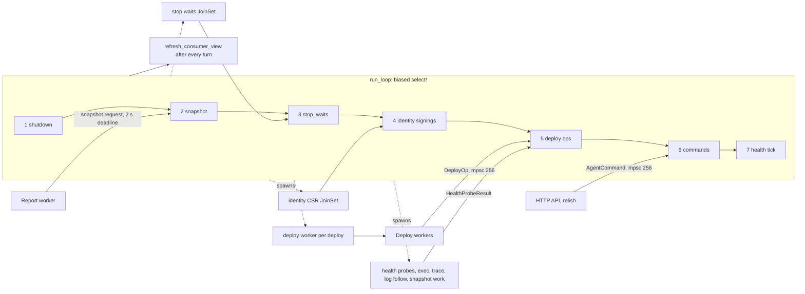

# Review: the node agent's loop

**Status:** decided, 30 September 2026. The maintainer approved option (c)
with the answers in [Decision](#decision). Work is tracked in #351.
Code references are against `9ba64f6c` (main, 30 September 2026).

Bun's agent loop (`run_loop`, `src/bun/agent.rs:3748`) caused most of the soak
failures in 0.1.0 and 0.1.1. We fixed each one where it hurt: a reorder here,
a budget there, one more slow operation moved into a task. Each fix was right
on its own. Together they made a loop whose correctness depends on a dozen
comments and on nobody adding a slow `await` in the wrong place.

This brief is for deciding whether to keep that shape or change it. It covers
how the loop works today (1), every failure it caused (2), what's still inline
and could stall it (3), three options (4), and a recommendation with open
questions (5).

## 1. How it works today

One `BunAgent` owns all of a node's local state: the supervisor's instances,
deployed specs, the service map and consumer view, fault registry, volume
leases, job and schedule records. Only the loop touches it, through `&mut self`.
That's the design's big advantage. Nothing is shared, so nothing needs a lock,
and cross-cutting invariants ("withdraw the backend before the runtime can
reuse its address", "no restart while a restore owns the volumes") hold because
only one thing runs at a time.

The cost is the same sentence read the other way: only one thing runs at a
time. A turn that awaits something slow holds every caller.

### The branches, in order

`tokio::select!` normally polls its branches in random order. `biased;`
(`agent.rs:3791`) makes it poll top to bottom, so a branch lower down runs
only when nothing above it is ready. The order is the loop's priority list.

| # | Branch | Line | What the turn does | Inline or spawned |
|---|---|---|---|---|
| 1 | `shutdown.cancelled()` | 3792 | Abandon pending stops and signings, `shutdown_all`, exit | Inline (last turn) |
| 2 | Snapshot request from the report worker | 3798 | `handle_snapshot_request` (3869): drops a request whose worker gave up, reads the runtime launch inventory under `LOOP_RUNTIME_INVENTORY_TIMEOUT` (1 s, `runtime_inventory.rs:14`), builds the `AgentSnapshot` | Inline, ≤ ~1 s |
| 3 | `stop_waits.join_next_with_id()` | 3801 | `complete_app_stop` (`app_stop.rs:138`): bookkeeping after a stop's drain, SIGTERM and SIGKILL finished in a task | Wait spawned, finish inline |
| 4 | `identity_signing_tasks.join_next_with_id()` | 3805 | `finish_identity_provision` (`identity_signing.rs:128`): write the signed cert | CSR spawned (`WORKLOAD_SIGNING_TIMEOUT` 15 s), finish inline |
| 5 | `deploy_ops_rx.recv()` | 3809 | `handle_deploy_op` (10848): the ~30 authoritative steps a deploy worker asks the loop to do, plus health probe results | Inline |
| 6 | `command_rx.recv()` | 3812 | `handle_command` (4468): ~50 `AgentCommand` variants | Mostly inline; see below |
| 7 | `health_interval.tick()` | 3815 | `run_health_tick` (3831) | Inline |

Above the `select!`, a floor keeps the tick alive: if
`HEALTH_TICK_STARVATION_BOUND` (5 s, line 78) has passed since the last tick,
the loop runs one before polling anything (3765). After every turn it calls
`refresh_consumer_view` (3823), which republishes the discovery view if a turn
marked it stale.

The comment at 3776–3789 explains the order: only branches that can't flood
sit above commands. Snapshots come once per report interval; stop and identity
completions are one per operation already started; each deploy worker waits
for its reply before sending the next op. Commands come from any number of
callers, so they sit near the bottom, and the tick sits under them.

### The tick

`run_health_tick` (3831) runs fifteen steps in sequence: reopen uncertain
discovery, fence a lapsed view, drive startup and deferred retirements, refresh
egress readiness, start health probes (spawned; results come back as
`DeployOp::HealthProbeResult`), check jobs, fire due cron jobs, check apps,
drive pending restarts, expire faults, reconcile the firewall, re-resolve
egress DNS, sweep kernel networking, check identity rotation.

### What's already off the loop

| Work | Where | Since |
|---|---|---|
| A whole deploy (pulls, rolling health waits, drains) | `DeployWorker` task per deploy, `begin_deploy` 4276 | #96, #163 |
| Stop grace, SIGTERM, SIGKILL for `Stop`/`Retire` | `stop_waits` `JoinSet` | #237 |
| Workload identity CSR signing | `identity_signing_tasks` `JoinSet`, 15 s | #277 |
| Health probes | `tokio::spawn` per due probe, `run_health_checks` 8116 | earlier |
| `exec`, `trace`, the follow part of log follow | `tokio::spawn` | H3, earlier |
| Snapshot create, list, restore, delete | `spawn_blocking` holding a `VolumeLease` | #329, #341 |
| Producer-release confirmation for retirements | task map, 1 s fresh wait | #172 (T1.6) |

### Deadlines and budgets

| Name | Value | Where | What it bounds |
|---|---|---|---|
| `HEALTH_TICK_STARVATION_BOUND` | 5 s | `agent.rs:78` | Longest a stream of higher branches can hold off the tick |
| `PENDING_RESTART_TICK_BUDGET` | 500 ms | `agent.rs:102`, used 8619 | Time one tick spends starting pending restarts. Checked *between* restarts, so the first one always runs in full; `restart_rotation` resumes next tick |
| `STATUS_RUNTIME_READ_TIMEOUT` | 500 ms | `agent.rs:91`, used 9874 | One shared deadline for every pid and exit-code read in a status answer, 8 at a time (`STATUS_RUNTIME_READ_CONCURRENCY`). Late ones become `runtime_unknown` |
| `LOOP_RUNTIME_INVENTORY_TIMEOUT` | 1 s | `runtime_inventory.rs:14` | The inventory read inside a snapshot turn |
| `SNAPSHOT_DEADLINE` | 2 s | `reporting/worker.rs:85` | Queue admission plus answer, per report |
| `BUSY_LOOP_STALE_WINDOWS` | 4 × `stale_report_timeout_secs` (2 min) | `reporting/worker.rs:82` | How long the worker re-sends the last answered snapshot with fresh readiness while the loop is busy. Past it, reports stop and the node is fenced |
| `NODE_FAULT_CLEAR_BUDGET` | `NODE_REQUEST_TIMEOUT` − 1 s = 4 s | `api.rs:7566` | The owning node's agent answer plus the reservation release wait, so a forwarded clear hears a verdict, not a timeout |
| `WORKLOAD_SIGNING_TIMEOUT` | 15 s | `identity_signing.rs:24` | One CSR round trip, now off the loop |
| Status API | 5 s | `api.rs:4226` | `local_statuses`: queue plus answer |

Volume maintenance leases (`volume_maintenance.rs:47`) are how snapshot work
left the loop without losing its invariant. The loop reserves an app's volumes
with no `await` between the check and the reservation (`agent.rs:4773–4790`),
hands the lease to a `spawn_blocking` task, and deploys, restarts and other
snapshot operations on that app are refused while the lease lives.
`release_then_answer` (4203) drops the lease *before* answering, because a
caller that has its answer may send the next request straight away (#340).
That ordering bug is the kind option (a) below would multiply.

## 2. History

Every failure where a slow turn of the loop was the root cause. The pattern
repeats: a caller times out, a report goes stale, the node looks dead.

| When | Symptom → root cause → fix | PR |
|---|---|---|
| 13 Jul | Deploys froze the loop while pulling → whole deploy ran on the loop → one `DeployWorker` task per deploy, steps come back as `DeployOp` | #96 |
| 19 Aug | Blue-green deploys froze ticks, status and RPC for fleet size × 30 s → `finalise_rolling_deploy` drained the old fleet inline → drain and stop moved into the deploy worker | #163 |
| 22 Sep | Commands, health and reports stalled while the cluster was degraded → retirement asked the leader to confirm producer release inline, 10 s per instance per tick → task map, 1 s fresh wait, retry | #172 (T1.6) |
| 24 Sep, tour | All three frontends piled onto one node after status timed out and reports went stale → a first image pull held runc's lifecycle lock and the loop read pid/cgroup of every instance, blocking 35 s → skip runtime reads for `Pending`/`Preparing` | #172 (Z6.7) |
| 26 Sep, V02 pulse `eced11c` | `/v1/status` 503 "agent status timed out", snapshot collection failing every 5 s, retirements over 10 s → `Stop`/`Retire`/egress fence waited out the 10 s SIGTERM grace inline, one instance at a time → `begin_app_stop` only; the wait goes to `stop_waits` | #237 |
| 27 Sep, V02 fast `0eb6071`, dead-worker 504 | Fault clear 504, node 2 stopped answering for good → every tick retried 6 pending restarts at ~400 ms (2.5 s tick, 1 s interval), and the unbiased `select!` let the always-due tick win the coin toss against every command → `biased;`, tick last; `NODE_FAULT_CLEAR_BUDGET` | #260 |
| 28 Sep, V02 final `ff854cb` | Nodes went stale, lost readiness; "no eligible nodes" for 46 s → #260 put snapshots *below* commands, and status polls flooded commands; late answers were built into closed oneshots → snapshots second; drop closed requests; worker re-sends the last snapshot for up to 2 min | #270 |
| 28–29 Sep, V02 final `3fcb1fd` | 8 of 15 pulse cases stuck at 0 replicas; deploys over 300 s; `registry-web` in health-wait 300 s → #260's order again: commands above deploy ops and stop completions, and status polling starved each deploy's first step → deploy ops and stop completions above commands; `HEALTH_TICK_STARVATION_BOUND` floor | #279 |
| 29 Sep, follow-ups | No new failure; turns could still last seconds → `PENDING_RESTART_TICK_BUDGET`; identity signing off the loop; `STATUS_RUNTIME_READ_TIMEOUT` with `runtime_unknown` | #277 |
| 30 Sep, 0.1.1 release CI | Spurious 409 "busy" on back-to-back snapshot calls → #329 moved snapshots off the loop, but the lease dropped after the answer → `release_then_answer` | #341 (#340) |

Related, not the loop's order: #278 (a quadratic capture read blocked a Tokio
worker during adoption, before `run_loop` started) and #275 (the placement
reconciler, not the agent, retired serially behind 300 s deploys). #257 was a
leak, not a stall.

The release closure record says it best
(`docs/qualification/2026-09-27-v0.1.0-release-closure.md:314`): "Reordering
the agent loop's `select!` fixed one starvation and exposed the next … What
finally helped was making every turn short (#277), not finding the perfect
order." The final candidate `7d7dfc0` passed the 8 h tier with all of this in.
None of #270, #277 or #279 was soaked on its own before merging.

Two loose ends. `docs/flakes.md` row 80 still says "any SIGTERM-deaf workload
holds its node's agent loop for the stop grace", which #237 fixed. And #346
(replicas pack onto one survivor after a node dies) is what created the load
behind #279. It's a scheduler bug, but it's an amplifier for every item in the
next section.

## 3. What's still inline

Every `await` on the loop that can take more than a few milliseconds. The
estimates are from reading the code and the soak journals, not measurements;
"unbounded" means no deadline in our code.

A command waits for the turn in progress. So the worst latency any caller sees
is the longest turn in this table, and the status and report deadlines (5 s,
2 s) are the ones that trip first.

### Runtime calls

| Await | Where | Estimate |
|---|---|---|
| `grill.state` for every running app, one at a time | `check_apps` 8581 (tick) | 10–30 ms each for runc (fork + exec); 100 instances ≈ 1–3 s. Seconds *each* while a create holds the instance's lifecycle lock. Unbounded |
| `grill.state` for every job | `check_jobs` 8466 (tick) | Same shape as above |
| `kill_and_wait_for_exit` on the first pending restart | `drive_pending_restarts` 8618, `agent.rs:177` | Up to 2 × `stop_confirmation_timeout` = 20 s by default. The budget is checked only between restarts |
| `grill.create`, `grill.start` for a restart | 8802, 8870 | runc: 100 ms – seconds; Apple: seconds (VM boot). Unbounded |
| `retain_network_reference` in `ApplyNetworkPreStart` | deploy op, 7276 | Runtime call under the lifecycle lock; ms normally, seconds behind a create |
| `grill.logs` per instance for `Logs` | `get_logs` 9985 | Reads the whole capture into a `String`. A 56 MB capture (#278's) is hundreds of ms plus the memory. Unbounded |
| Status runtime reads | `get_status` 9873 | Bounded at 500 ms. But every status poll can cost 500 ms of loop time, and a soak polls from several places |

### Council and peers

| Await | Where | Estimate |
|---|---|---|
| `council.write` + `security_state_linearizable` for `JoinIssue` | 9688, 9709 | Tens of ms with quorum. Without quorum, openraft's `client_write` waits until the leader steps down: seconds, possibly longer. Unbounded |
| `council.write(AttachSignature)` for `SignImage` | 9768 | Same |
| `council.desired_state()` clones the whole desired state for `Council` | 4149 | ms today; grows with state size |
| Upgrade binary fetch in `UpgradeApply` | `handle_upgrade_apply` 5165, `upgrade/manager.rs:64` | 60 s per attempt, with retries: minutes. The node is draining anyway, but status and reports go unanswered, and the worker's 2 min grace can run out |
| Egress DNS re-resolution, per binding and host, in sequence | `reresolve_egress` 7961 (every 300 ticks) | ms when DNS works; 5–10 s per host against an unreachable resolver. Unbounded |

### Disk, kernel and subprocesses

| Await | Where | Estimate |
|---|---|---|
| `spawn_blocking` persists, awaited inline: job ledger 2857, instance record 3138, schedules 8326, egress owners (`egress_ownership.rs:169`), discovery owners | many deploy ops, `begin_deploy`, stops, restarts | 1–50 ms with fsync; seconds under disk pressure. `spawn_blocking` keeps the runtime's workers free, but the loop still waits |
| Artifact cleanup in retirements | `retire_instance_artifacts` 9562 (tick) | Removing a rootfs: ms to seconds |
| `nft` ruleset apply | `reconcile_firewall` 9472 (tick, on membership change) | 50–500 ms subprocess. Unbounded |
| Fault apply, reverse, network reconcile | 5541, 6043, 6265 (commands, `expire_faults`) | cgroup writes, signals, eBPF maps: ms to hundreds of ms |
| Consumer view and catalogue republication | `refresh_consumer_view` (every turn), `synchronise_consumer` `consumer.rs:341`, `publish_cluster_catalogue` 9312 | Persist + eBPF map rewrite + routing rebuild, O(catalogue): 10–100 ms |

### Callers that can hold a turn

| Await | Where | Estimate |
|---|---|---|
| `FollowLogs` with `tail`: `lines.send(...).await` into a 64-slot channel the HTTP client drains | 10033 | Unbounded. A client that stops reading (`relish logs -f | less`, a stuck proxy) holds the loop once 64 lines are queued. Not seen in a soak yet; found by reading |

## 4. Options

All three keep the rule we already follow: tests first, and every existing
starvation test (`agent.rs:17125`, 17200, 17311, 17335, 17456) passes
unchanged.

### (a) An actor per concern

The loop becomes a router. Discovery, faults, lifecycle, jobs, council-facing
work (join, sign, upgrade) and logs each get their own task with their own
state and channel. Every slow operation is a spawned task that reports back.

- **Effort:** 15–25 days, plus a full V02 re-qualification.
- **Risk:** high. The single owner is why cross-concern invariants hold today:
  withdraw before kill (8744–8763), no restart during a restore (8634), no
  deploy of a stopping app (`begin_deploy`), lease before answer (#340). Split
  the state and each of those becomes a protocol between actors, with new
  ordering bugs of exactly the #340 kind. Also a very large diff to a
  25,000-line file.
- **Tests first:** property tests for each cross-actor invariant (interleave
  messages, assert the invariant) before any split; then the existing suites
  and a soak.
- **Book:** a rewrite, not a section. Chapter 1 introduces the loop, Chapter 15
  tells its story; both would need to explain actors, message protocols and
  why we traded the borrow checker's guarantee (`&mut self`, one owner) for
  runtime ordering.
- **0.2.0 (#266):** no conflict. The million-jobs work already has this shape:
  `task_array_node.rs`, `task_executor.rs` and the leader loop are their own
  tasks with their own HTTP route and ledger, and the branch changes nothing in
  `agent.rs`. It's a good precedent, but for a concern with no shared state.
- **0.4.0 (#268):** migration would get its own actor, but a migration touches
  lifecycle, discovery, volumes and identity at once, which is the worst case
  for this split.

### (b) A supervisor task per instance

Each instance gets a task that owns its lifecycle: create, start, probe,
kill, wait for exit, restart with backoff. The loop stays the single owner of
shared state (ports, service map, specs, leases, fault registry) and
coordinates: it tells an instance task what to do and applies the events it
reports ("running at 10.0.1.7", "exited 137", "cleanup confirmed").

- **Effort:** 10–15 days.
- **Risk:** medium-high. It removes the biggest remaining inline category (all
  runtime calls in the tick) and gives the stop, restart and deploy paths one
  owner per instance instead of three code paths. The ordering invariants that
  cross instances stay on the loop. The risk is in the handover: today
  `deploy_ops` and the tick both drive instance state; both would have to
  become messages to the instance task. Adoption after a Bun restart
  (`startup_recovery.rs`) has to rebuild the tasks.
- **Tests first:** a state-machine test per instance-task transition (every
  valid and invalid one, as CLAUDE.md asks); the existing starvation tests; a
  new test that 100 instances with a 400 ms mock runtime keep every loop turn
  under 50 ms; then `test-cluster`, `test-linux` and the V02 fast tier.
- **Book:** a new section in Chapter 15 after "Shorter turns": one task per
  container, what moves into it, why ownership pushes us there (a task that
  owns its `Instance` can await as long as it likes; `&mut self` across an
  `await` on the loop is what made every slow call everyone's problem).
  Introduces `JoinSet` supervision and the "owner reports events" pattern.
- **0.2.0 (#266):** independent. Task-array tasks don't go through the
  supervisor.
- **0.4.0 (#268):** the strongest fit. A migration is a per-instance state
  machine (checkpoint, copy, restore, hand off TCP) whose steps take seconds to
  minutes. With (b) it's more states in the instance task. Without it, the
  0.4.0 work has to invent the same thing, or risk #163 again: a drain that
  moves a node's instances with any step inline.

### (c) Keep the design; add a rule, a meter and a starvation harness

Keep one loop, one owner. Make "every turn is short" a checked property
instead of a habit:

1. **A meter.** Time every turn by branch. Export
   `bun_agent_loop_turn_seconds{branch}` to Mayo and log any turn over 250 ms
   with its branch and command variant. The V02 checker fails a tier whose
   worst turn exceeds a threshold (2 s? see open questions).
2. **A harness.** A `MockGrill` where every call can be slowed (the pid-read
   delay at `grill/mock.rs:360` is the start), a council whose writes hang, a
   log client that never reads. One test per command, deploy op and tick step
   asserts that a status command queued during it is answered within 1 s.
   Under `cfg(test)` the loop records its longest turn and the harness asserts
   on it.
3. **The rule.** "No `await` on the loop without a deadline under 250 ms,
   unless it's in the allowlist with a comment saying why." Clippy can't
   express that, so it's a test (2) plus a short checklist in `agent.rs`'s
   module doc. A `// LOOP-INLINE:` comment on each allowlisted await makes the
   review mechanical and greppable.
4. **Fix what the harness finds.** Section 3 predicts the list: bound and
   parallelise `check_apps`/`check_jobs` like status; spawn restart
   kill/create/start as a per-restart task reporting back (a narrow slice of
   (b)); spawn `Logs`, the `FollowLogs` tail, `JoinIssue`, `SignImage`, the
   upgrade fetch, DNS re-resolution and `nft`.

- **Effort:** 3 days for the meter, harness and rule; 4–6 more for the fixes.
  About 8 days in all.
- **Risk:** low. Each fix is the same move we've made eight times, now with a
  test that fails before it and a meter that would have caught #279 in the
  fast tier. What it doesn't fix: every new feature still has to decide what's
  inline, and the loop stays the only place a node's state changes.
- **Tests first:** the harness *is* the tests; write it, watch it fail on the
  section 3 items, fix until green.
- **Book:** a new section closing Chapter 15's loop story, "A rule you can
  test": the meter, the harness, how to read a turn histogram, and why a
  budget beats a priority order. Short, and it ends the arc the chapter
  already started.
- **0.2.0 (#266):** the harness should add a CPU-contention case. The task
  pool can keep a 2-vCPU node busy with thousands of processes, and every
  inline runtime call gets slower under that load, which is exactly when the
  meter matters. The 1M-task demo is a good soak for the meter.
- **0.4.0 (#268):** the rule tells migration work what not to do, and the
  harness catches it if it does. But migration would still need its own
  per-instance machinery, so (c) now doesn't remove the (b) decision; it moves
  it to 0.4.0's design.

## 5. Recommendation

Do (c) now, as a 0.1.2 item, with the restart path moved into per-restart
tasks as its biggest fix. Decide (b) as part of 0.4.0's design, where
migration needs per-instance state machines anyway. Don't do (a).

The reasoning: every failure in section 2 was a long turn, and every fix that
held was a shorter turn. (c) turns that lesson into a test and a number the
soak checks, for about eight days, without touching the single-owner property
that keeps the invariants simple. (b) is probably where the code ends up, but
the reason to pay for it is 0.4.0, not today's bugs. (a) pays the most to buy
the least.

### Open questions for the maintainer

1. **Turn threshold.** What worst turn should fail a soak tier: 1 s, 2 s? The
   report deadline (2 s) and the status deadline (5 s) bound it from above.
2. **Allowlist.** Are fsync'd persists (1–50 ms) fine inline, as long as the
   harness bounds them under disk pressure? Moving them off the loop means
   answering callers before state is durable, which the job ledger and
   discovery owners were written to avoid.
3. **Restart slice.** Is moving restarts into per-restart tasks in (c) the
   right size, or should that step wait for (b) so we build the per-instance
   task only once?
4. **Upgrade.** Should `UpgradeApply` stay on the loop on purpose, since the
   node is draining? If so, the report worker's 2 min grace needs to cover the
   worst fetch, or the upgrade path needs to tell the worker it's busy.
5. **Status polling.** Should the soak and `relish` poll status less, or should
   status read a snapshot the loop publishes (a `watch` channel) instead of
   asking the loop at all? The second removes the largest command class from
   the loop entirely and is small on its own.
6. **#346.** The scheduler pile-up amplified #279. Fix it before the harness
   work, or in parallel?

## Decision

The maintainer approved recommendation 1: **option (c)**. We keep the
single-owner loop and add a meter, a starvation harness and a rule, then fix
what the harness finds. (b) stays on the table for 0.4.0's design; (a) is off
it. The open questions are answered as follows.

1. **Turn threshold: 1 s.** A soak tier whose worst turn exceeds 1 s fails.
   It sits well under the report deadline (2 s), so a node fails the checker
   before it goes stale, not after.
2. **fsync'd persists may stay inline.** Each one carries a `// LOOP-INLINE:`
   comment saying why, and the harness bounds it under slow-disk conditions.
   Answering before state is durable would undo what the job ledger and
   discovery owners were written for.
3. **Restarts move into per-restart tasks now**, in (c). The task takes the
   kill, create and start and reports back to the loop, shaped so that (b)'s
   per-instance supervisor can absorb it later instead of replacing it.
4. **The upgrade fetch leaves the loop.** Only the final commit and exec stay
   on it, so status and reports keep flowing while a node downloads its next
   binary.
5. **Status reads a published snapshot.** The loop publishes a status snapshot
   on a `tokio::sync::watch` channel and `/v1/status` reads it without asking
   the loop. That takes the largest command class off the loop entirely.
6. **#346 is fixed** (#349 merged), so it no longer amplifies the harness
   work.

### Stages

The work is three stages, each its own PR under #351.

| Stage | What it does | Done when |
|---|---|---|
| 1 | The meter (`bun_agent_loop_turn_seconds{branch}` through Mayo, the worst turn recorded under `cfg(test)`), the starvation harness (slowable `MockGrill`, a council write that hangs, a log client that never reads, one scenario per stall in section 3) and the rule (`// LOOP-INLINE:` on every allowlisted await, plus a mechanical check). Scenarios that fail are `#[ignore = "stage N of #351"]` | The meter exports, the check runs in `make ci`, every section 3 stall has a scenario |
| 2 | Status via `watch`; bounded, parallel `check_apps` and `check_jobs`; restarts in per-restart tasks | The stage-2 scenarios run un-ignored and pass |
| 3 | The remaining inline awaits leave the loop (`Logs`, the `FollowLogs` tail, `JoinIssue`, `SignImage`, the upgrade fetch, DNS re-resolution, `nft`, and whatever else the harness flags); the V02 soak checker fails a tier on the meter's worst turn | No ignored harness scenario is left, and the checker gates on the meter |

